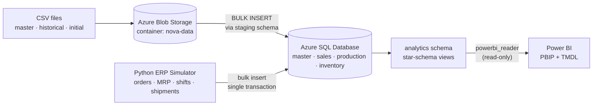
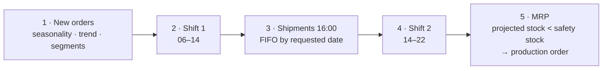

# Nova Components — Plataforma de datos end-to-end en Azure


Solución de datos de extremo a extremo para **Nova Components**, un fabricante ficticio con dos plantas, seis líneas de producción y doce materiales definidos por planta. Los datos parten de archivos CSV y se cargan en una base de datos operacional en la nube. Un simulador ERP en Python le agrega actividad nueva, los datos se modelan en un esquema estrella y terminan en un modelo semántico de Power BI versionado como código.

El proyecto partió de la guía de una masterclass. Sobre esa base construí un simulador ERP coherente con planificación MRP, restricciones de calidad de datos, pruebas de reconciliación, una capa analítica con acceso de mínimo privilegio y gestión de credenciales.

---

## Arquitectura



| Capa | Tecnología | Responsabilidad |
|---|---|---|
| Aterrizaje | Azure Blob Storage | Datos maestros iniciales, pedidos históricos y stock de apertura en CSV |
| Operacional | Azure SQL Database | Modelo normalizado en 4 esquemas de negocio, protegido con FK y CHECK constraints |
| Ingesta | T-SQL `BULK INSERT` + esquema `staging` | CSV → staging → inserción validada en las tablas finales |
| Actividad | Python (SQLAlchemy, pyodbc, NumPy) | Simulación ERP día a día que escribe transacciones coherentes |
| Analítica | Vistas SQL (esquema `analytics`) | Esquema estrella con 4 dimensiones y 5 tablas de hechos, reconciliado con los datos operacionales |
| BI | Power BI Desktop (PBIP, TMDL) | Modelo semántico y reporte versionados en Git |

---

## Aspectos destacados

- **Una simulación coherente, no filas aleatorias.** Todo despacho está respaldado por stock, toda entrada de producción coincide con la cantidad buena de sus eventos y el inventario nunca es negativo en ningún momento. Todo esto se verifica con pruebas en SQL.
- **Lógica MRP.** Se crean órdenes de producción cuando el *stock proyectado* (existencias + en producción − demanda abierta) cae por debajo del safety stock. Cada orden se asigna a la única línea con la misma planta y familia de producto.
- **Calidad de datos en la propia base.** Los CHECK constraints obligan a usar estados válidos, que el rechazo no supere lo producido, que lo entregado no supere lo pedido y que cada tipo de movimiento tenga el signo correcto. La base rechaza los datos incoherentes al momento de escribirlos.
- **Cargas idempotentes e incrementales.** La tabla `simulator.run_log` funciona como marca de agua: cada ejecución continúa desde el último día simulado. Cada ejecución escribe en una sola transacción con `fast_executemany`, así que un fallo no deja nada a medias.
- **Mínimo privilegio.** Power BI se conecta con un usuario contenido que **solo** puede leer el esquema `analytics`.
- **Credenciales fuera de Git.** Las credenciales viven en `.env`. El historial de Git se reescribió con `git filter-repo` para eliminar los secretos que se habían versionado al inicio del proyecto.
- **BI como código.** El proyecto de Power BI se guarda como PBIP con modelo semántico en TMDL, así que los cambios del modelo aparecen como diffs legibles.

---

## Estructura del repositorio

```text
nova-analytics-project/
├── data/                         # CSV fuente (se suben a Blob Storage)
│   ├── master/                   # plantas, clientes, materiales, líneas de producción
│   ├── historical/               # 20 pedidos históricos (ene–ago 2026)
│   └── initial/                  # stock de apertura (2026-01-01)
├── sql/
│   ├── 00_db_queries/            # Consultas de inspección: base, identidad, roles
│   ├── 01_schemas/               # master, sales, production, inventory
│   ├── 02_tables/                # 9 tablas operacionales
│   ├── 03_load_csv_blob/         # Credencial y origen externo de Blob, cargas vía staging, validación
│   ├── 04_simulator/             # Cambios de esquema, reset, CHECK constraints, pruebas de la simulación
│   └── 05_analytics/             # Vistas del esquema estrella, usuario de solo lectura, reconciliación
├── python/
│   ├── connection.py             # Engine de SQLAlchemy a partir de variables de entorno
│   └── erp_simulator.py          # Simulador ERP día a día
├── powerbi/
│   ├── nova_pbi.pbip             # Proyecto de Power BI
│   ├── nova_pbi.SemanticModel/   # Modelo TMDL: tablas, relaciones, medidas
│   ├── nova_pbi.Report/          # Definición del reporte
│   └── measures.dax              # Catálogo de medidas DAX
├── docs/
│   ├── power_bi_guide.md         # Configuración del modelo: modos de almacenamiento, relaciones, páginas
│   ├── esquema_arquitectura.png
│   ├── esquema_tablas.png
│   └── Diccionario_Definitivo_Modelo_Minimo_Nova_Components.pdf
├── .env.example                  # Plantilla de credenciales locales
├── requirements.txt
└── README.md
```

---

## Modelo de datos

### Modelo operacional (Azure SQL)

| Esquema | Tablas | Granularidad |
|---|---|---|
| `master` | `plant`, `customer`, `material`, `production_line` | Datos maestros; materiales y líneas se definen por planta |
| `sales` | `sales_order`, `sales_order_line` | Una fila por pedido y una por material dentro del pedido |
| `production` | `production_order`, `production_event` | Una fila por orden y una por evento de turno (cantidades incrementales) |
| `inventory` | `inventory_movement` | Movimientos con signo: `INITIAL_STOCK (+)`, `PRODUCTION_RECEIPT (+)`, `CUSTOMER_SHIPMENT (−)` |
| `simulator` | `run_log` | Una fila por ejecución del simulador (marca de agua y auditoría) |

El stock actual nunca se guarda en una columna: siempre es `SUM(inventory_movement.quantity)`.

### Capa analítica (esquema estrella)

| Dimensiones | Hechos (granularidad) |
|---|---|
| `dim_date`: calendario 2025–2027 en español, con indicador de día hábil | `fact_sales`: línea de pedido (backlog, OTIF, vencidos) |
| `dim_customer`: con segmento derivado | `fact_shipment`: despacho (puntualidad frente a la fecha solicitada) |
| `dim_material`: material × planta, con los atributos de la planta | `fact_production_order`: orden de producción (cumplimiento, lead time, puntualidad) |
| `dim_production_line` | `fact_production_event`: evento por turno (producido, rechazado, bueno, tasa de rechazo) |
| | `fact_inventory_daily`: material × día, stock al cierre frente a safety stock |

La planta va dentro de `dim_material`. Así todas las tablas de hechos filtran por planta a través del material, y en Power BI no hay rutas de relación ambiguas.

---

## Simulador ERP

`python/erp_simulator.py` reproduce el flujo de negocio **día a día**, solo en días hábiles:



- **Demanda.** Llegadas de pedidos tipo Poisson por planta, con estacionalidad mensual (agosto y diciembre bajos), tendencia de +8 % anual, segmentos de cliente que definen tamaño y descuento, y cantidades lognormales.
- **Producción.** Dos turnos por línea con una orden por turno, disponibilidad (OEE) entre 75 % y 95 %, averías aleatorias y tasas de rechazo por familia, con **anomalías de calidad** ocasionales que quedan como señal para trabajos futuros de ML.
- **Despachos.** Se atienden por orden de fecha solicitada (FIFO), se permiten entregas parciales y nunca se despacha más de lo que hay en stock.
- **Planificación.** Tamaño de lote = brecha frente al safety stock + 5 días de cobertura de demanda (promedio móvil de 20 días), redondeado a múltiplos de 50.

Los pasos se ejecutan en ese orden para que los timestamps de los eventos sean cronológicamente válidos.

```powershell
python python/erp_simulator.py --dry-run          # simula y muestra un resumen, sin escribir
python python/erp_simulator.py                    # simula hasta hoy y guarda
python python/erp_simulator.py --days 1           # simula solo el día siguiente
python python/erp_simulator.py --end 2026-12-31   # simula hasta una fecha concreta
```

Todos los parámetros de comportamiento (demanda, tasas de rechazo, días de cobertura, tamaño de lote…) son constantes al inicio del archivo.

**Primera ejecución (2026-01-02 → 2026-10-03, 194 días hábiles):**

| Métrica | Valor |
|---|---|
| Pedidos nuevos | 1.152 (2.107 líneas) + 20 históricos |
| Órdenes / eventos de producción | 452 / 1.945 |
| Movimientos de inventario | 4.073 |
| Unidades producidas | 2,36 M |
| Tasa de rechazo | 2,88 % |
| Despachos a tiempo | 94,1 % (126 tarde de 2.128) |
| Materiales bajo safety stock al cierre | 0 |

---

## Calidad de datos y validación

| Script | Qué verifica |
|---|---|
| `sql/03_load_csv_blob/99_validate_load.sql` | Filas en staging frente a las tablas finales, joins sin coincidencia, conversiones fallidas |
| `sql/04_simulator/03_add_constraints.sql` | Reglas de negocio como CHECK constraints (estados, cantidades, signo de los movimientos) |
| `sql/04_simulator/99_validate_simulation.sql` | Stock nunca negativo en el tiempo · entradas = cantidad buena por orden · despachos = entregado por línea de pedido · línea y material de la misma planta y familia · estados coherentes con el avance |
| `sql/05_analytics/99_validate_analytics.sql` | La capa analítica cuadra con las tablas operacionales (diferencia = 0) · integridad referencial de hechos frente a dimensiones |

---

## Power BI

- **Conexión:** Azure SQL Database con autenticación SQL, usuario `powerbi_reader`, que solo tiene `SELECT` sobre el esquema `analytics`.
- **Modelo:** esquema estrella con relaciones 1:* de una sola dirección. `dim_date` está marcada como tabla de fechas, y `requested_delivery_date` es una relación inactiva que se usa con `USERELATIONSHIP`.
- **Almacenamiento:** Import. DirectQuery sobre `fact_production_event` queda documentado como opción para monitoreo casi en tiempo real.
- **Medidas:** el catálogo de `powerbi/measures.dax` cubre ventas (valor de pedidos, backlog, backlog vencido, OTIF %, variación mensual), despachos (% a tiempo, retraso promedio), producción (tasa de rechazo, cumplimiento del plan, producción a tiempo, utilización de capacidad) e inventario. Las medidas de inventario son semiaditivas: toman el stock del último día del periodo, nunca la suma de los días. También incluye los días de cobertura.
- **Páginas del reporte:** Resumen ejecutivo · Ventas y backlog · Producción y calidad · Inventario.

Guía completa de configuración: [`docs/power_bi_guide.md`](docs/power_bi_guide.md).

---

## Cómo ejecutarlo

**Requisitos:** una suscripción de Azure (oferta gratuita de Azure SQL Database y una Storage Account), Python 3.11 o superior, el [ODBC Driver 18 for SQL Server](https://learn.microsoft.com/sql/connect/odbc/download-odbc-driver-for-sql-server) y Power BI Desktop.

1. **Recursos en Azure:** un Resource Group, un servidor y una base de datos de Azure SQL, y una Storage Account con un contenedor `nova-data` que contenga las carpetas de `data/`.
2. **Base operacional:** ejecuta `sql/01_schemas` → `sql/02_tables` → `sql/03_load_csv_blob`. Reemplaza los marcadores `<...>` solo al momento de ejecutar.
3. **Entorno de Python:**
   ```powershell
   pip install -r requirements.txt
   Copy-Item .env.example .env      # luego completa tus valores
   python python/connection.py      # prueba de conexión
   ```
4. **Simulador:** ejecuta `sql/04_simulator/01` → `02` → `03`, luego `python python/erp_simulator.py` y después `99_validate_simulation.sql`.
5. **Analítica:** ejecuta `sql/05_analytics/01` → `02` → `99_validate_analytics.sql`.
6. **Power BI:** abre `powerbi/nova_pbi.pbip` y actualiza las credenciales del origen de datos.

> Las credenciales se leen de `.env`, que está en `.gitignore`. Nunca subas contraseñas reales ni tokens SAS al repositorio.

---

## Hoja de ruta

- [x] Zona de aterrizaje en la nube e ingesta de CSV (Blob → Azure SQL)
- [x] Simulador ERP coherente con MRP, turnos e inventario
- [x] Restricciones de calidad de datos y suites de validación
- [x] Capa analítica en esquema estrella y acceso de solo lectura para BI
- [x] Modelo semántico de Power BI como código (PBIP / TMDL)
- [ ] Terminar las páginas del reporte y agregar capturas
- [ ] **Pronóstico de demanda** por material (baseline estacional → LightGBM, backtesting de series de tiempo, seguimiento con MLflow), con las predicciones escritas en `analytics.fact_forecast`
- [ ] **Safety stock dinámico** a partir del error de pronóstico y un nivel de servicio objetivo
- [ ] **Detección de anomalías** en la tasa de rechazo por turno
- [ ] Orquestación (GitHub Actions / Azure Functions) para simular y reentrenar de forma programada
- [ ] Evolución a Lakehouse: ADLS Gen2 → Delta Lake → Microsoft Fabric / Databricks

---

## Autor

**Juan Pablo Quintero**: estudiante de Ingeniería Financiera (ITM), en transición del análisis de datos hacia la ingeniería de datos y de machine learning.
Portafolio: [juancho-00.github.io](https://juancho-00.github.io)
