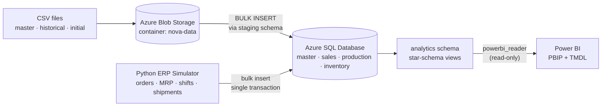
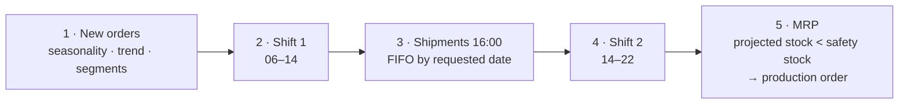

# Nova Components — End-to-End Data Platform on Azure


An end-to-end data solution for **Nova Components**, a fictional manufacturer with two plants, six production lines and twelve plant-specific materials. Data moves from raw CSV files to a cloud operational database, gets new activity from a Python ERP simulator, is modelled into a star schema, and ends up in a Power BI semantic model stored as code.

The project started from a masterclass guide. On top of it I built a consistent ERP simulator with MRP planning, data-quality constraints and reconciliation tests, a least-privilege analytics layer, and secrets management.

---

## Architecture



| Layer | Technology | Responsibility |
|---|---|---|
| Landing | Azure Blob Storage | Initial master data, historical orders and opening stock as CSV |
| Operational | Azure SQL Database | Normalized model in 4 business schemas, enforced with FK + CHECK constraints |
| Ingestion | T-SQL `BULK INSERT` + `staging` schema | CSV → staging → validated insert into final tables |
| Activity | Python (SQLAlchemy, pyodbc, NumPy) | Day-by-day ERP simulation that writes consistent transactions |
| Analytics | SQL views (`analytics` schema) | Star schema: 4 dimensions + 5 fact tables, reconciled against the operational data |
| BI | Power BI Desktop (PBIP, TMDL) | Semantic model and report versioned in Git |

---

## Highlights

- **Consistent simulation, not random rows.** Every shipment is backed by stock, every production receipt matches the good quantity of its production events, and inventory never goes negative at any timestamp. All of this is verified by SQL tests.
- **MRP logic.** Production orders are created when *projected stock* (on hand + in production − open demand) falls below the safety stock. Each order is assigned to the only line with the same plant and product family.
- **Data quality in the database.** CHECK constraints enforce valid statuses, `rejected ≤ produced`, `delivered ≤ ordered` and movement sign per movement type. Incoherent data is rejected at write time.
- **Idempotent, incremental loads.** A `simulator.run_log` watermark lets each run continue from the last simulated day. Each run writes in one transaction with `fast_executemany`, so a failure leaves nothing half-written.
- **Least privilege.** Power BI connects with a contained user that can read **only** the `analytics` schema.
- **Secrets out of Git.** Credentials live in `.env`. The Git history was rewritten with `git filter-repo` to remove secrets committed early in the project.
- **BI as code.** The Power BI project is saved as PBIP with a TMDL semantic model, so model changes appear as readable diffs.

---

## Repository structure

```text
nova-analytics-project/
├── data/                         # Source CSV files (uploaded to Blob Storage)
│   ├── master/                   # plants, customers, materials, production_lines
│   ├── historical/               # 20 historical sales orders (Jan–Aug 2026)
│   └── initial/                  # opening stock (2026-01-01)
├── sql/
│   ├── 00_db_queries/            # Database / identity / role inspection queries
│   ├── 01_schemas/               # master, sales, production, inventory
│   ├── 02_tables/                # 9 operational tables
│   ├── 03_load_csv_blob/         # Blob credential + external data source, staging loads, validation
│   ├── 04_simulator/             # Schema changes, reset, CHECK constraints, simulation tests
│   └── 05_analytics/             # Star-schema views, read-only Power BI user, reconciliation
├── python/
│   ├── connection.py             # SQLAlchemy engine from environment variables
│   └── erp_simulator.py          # Day-by-day ERP simulator
├── powerbi/
│   ├── nova_pbi.pbip             # Power BI project
│   ├── nova_pbi.SemanticModel/   # TMDL model: tables, relationships, measures
│   ├── nova_pbi.Report/          # Report definition
│   └── measures.dax              # DAX measure catalogue
├── docs/
│   ├── power_bi_guide.md         # Model setup: storage modes, relationships, pages
│   ├── esquema_arquitectura.png
│   ├── esquema_tablas.png
│   └── Diccionario_Definitivo_Modelo_Minimo_Nova_Components.pdf
├── .env.example                  # Template for local credentials
├── requirements.txt
└── README.md
```

---

## Data model

### Operational model (Azure SQL)

| Schema | Tables | Grain |
|---|---|---|
| `master` | `plant`, `customer`, `material`, `production_line` | Master data; materials and lines are defined per plant |
| `sales` | `sales_order`, `sales_order_line` | One row per order / per material in an order |
| `production` | `production_order`, `production_event` | One row per order / per shift event (incremental quantities) |
| `inventory` | `inventory_movement` | Signed movements: `INITIAL_STOCK (+)`, `PRODUCTION_RECEIPT (+)`, `CUSTOMER_SHIPMENT (−)` |
| `simulator` | `run_log` | One row per simulator run (watermark and audit) |

Current stock is never stored. It is always `SUM(inventory_movement.quantity)`.

### Analytics layer (star schema)

| Dimensions | Facts (grain) |
|---|---|
| `dim_date`: calendar 2025–2027, Spanish labels, working-day flag | `fact_sales`: sales order line (backlog, OTIF, overdue) |
| `dim_customer`: with derived segment | `fact_shipment`: shipment (on-time vs requested date) |
| `dim_material`: material × plant, plant attributes denormalized | `fact_production_order`: production order (attainment, lead time, on-time) |
| `dim_production_line` | `fact_production_event`: shift event (produced, rejected, good, reject rate) |
| | `fact_inventory_daily`: material × day closing stock vs safety stock |

The plant is carried inside `dim_material`. Every fact table filters by plant through the material, which avoids ambiguous relationship paths in Power BI.

---

## ERP simulator

`python/erp_simulator.py` replays the business flow **day by day**, on working days only:



- **Demand.** Poisson order arrivals per plant, with monthly seasonality (August and December are low), +8 % yearly trend, customer segments that set order size and discount, and lognormal quantities.
- **Production.** Two shifts per line, one order per shift, availability (OEE) between 75 % and 95 %, random breakdowns, and family-specific reject rates with occasional **quality anomalies**, kept as a signal for future ML work.
- **Shipments.** FIFO by requested date, allow partial deliveries, and never ship more than the stock on hand.
- **Planning.** Lot size = gap to safety stock + 5 days of demand cover (20-day moving average), rounded to multiples of 50.

The steps run in this order so that event timestamps stay chronologically valid.

```powershell
python python/erp_simulator.py --dry-run          # simulate and print a summary, no writes
python python/erp_simulator.py                    # simulate up to today and persist
python python/erp_simulator.py --days 1           # simulate only the next day
python python/erp_simulator.py --end 2026-12-31   # simulate up to a given date
```

All behaviour parameters (demand, reject rates, cover days, lot size…) are constants at the top of the file.

**First run (2026-01-02 → 2026-10-03, 194 working days):**

| Metric | Value |
|---|---|
| New sales orders | 1,152 (2,107 lines) + 20 historical |
| Production orders / events | 452 / 1,945 |
| Inventory movements | 4,073 |
| Units produced | 2.36 M |
| Reject rate | 2.88 % |
| On-time shipments | 94.1 % (126 late of 2,128) |
| Materials below safety stock at close | 0 |

---

## Data quality & validation

| Script | What it checks |
|---|---|
| `sql/03_load_csv_blob/99_validate_load.sql` | Staging vs final row counts, unmatched joins, failed casts |
| `sql/04_simulator/03_add_constraints.sql` | Business rules as CHECK constraints (statuses, quantities, movement sign) |
| `sql/04_simulator/99_validate_simulation.sql` | Stock never negative over time · receipts = good quantity per order · shipments = delivered per order line · line/material plant and family match · order statuses match progress |
| `sql/05_analytics/99_validate_analytics.sql` | Analytics layer reconciles with operational tables (difference = 0) · referential integrity of facts vs dimensions |

---

## Power BI

- **Connection:** Azure SQL Database with SQL authentication, user `powerbi_reader`, which has `SELECT` on schema `analytics` only.
- **Model:** star schema with single-direction 1:* relationships. `dim_date` is marked as the date table, and `requested_delivery_date` is an inactive relationship used through `USERELATIONSHIP`.
- **Storage:** Import. DirectQuery on `fact_production_event` is documented as an option for near-real-time monitoring.
- **Measures:** a catalogue in `powerbi/measures.dax` covering sales (order value, backlog, overdue backlog, OTIF %, MoM %), shipments (on-time %, average delay), production (reject rate, plan attainment, on-time production, capacity utilization) and inventory. Inventory measures are semi-additive: they take stock on the last day of the period, never a sum over days. Days of cover is also included.
- **Report pages:** Executive summary · Sales & backlog · Production & quality · Inventory.

Full setup guide: [`docs/power_bi_guide.md`](docs/power_bi_guide.md).

---

## Getting started

**Prerequisites:** an Azure subscription (Azure SQL Database free offer and a Storage Account), Python 3.11+, [ODBC Driver 18 for SQL Server](https://learn.microsoft.com/sql/connect/odbc/download-odbc-driver-for-sql-server), and Power BI Desktop.

1. **Azure resources:** a Resource Group, an Azure SQL server and database, and a Storage Account with a `nova-data` container holding the `data/` folders.
2. **Operational database:** run `sql/01_schemas` → `sql/02_tables` → `sql/03_load_csv_blob`. Replace the `<...>` placeholders at execution time only.
3. **Python environment:**
   ```powershell
   pip install -r requirements.txt
   Copy-Item .env.example .env      # then fill in your values
   python python/connection.py      # connection test
   ```
4. **Simulator:** run `sql/04_simulator/01` → `02` → `03`, then `python python/erp_simulator.py`, then `99_validate_simulation.sql`.
5. **Analytics:** run `sql/05_analytics/01` → `02` → `99_validate_analytics.sql`.
6. **Power BI:** open `powerbi/nova_pbi.pbip` and update the data source credentials.

> Credentials are read from `.env`, which is git-ignored. Never commit real passwords or SAS tokens.

---

## Roadmap

- [x] Cloud landing zone and CSV ingestion (Blob → Azure SQL)
- [x] Consistent ERP simulator with MRP, shifts and inventory
- [x] Data-quality constraints and validation suites
- [x] Star-schema analytics layer and read-only BI access
- [x] Power BI semantic model as code (PBIP / TMDL)
- [ ] Finish report pages and add screenshots
- [ ] **Demand forecasting** per material (seasonal baseline → LightGBM, time-series backtesting, MLflow tracking), with predictions written to `analytics.fact_forecast`
- [ ] **Dynamic safety stock** from forecast error and target service level
- [ ] **Anomaly detection** on shift reject rates
- [ ] Orchestration (GitHub Actions / Azure Functions) for scheduled simulation and retraining
- [ ] Lakehouse evolution: ADLS Gen2 → Delta Lake → Microsoft Fabric / Databricks

---

## Author

**Juan Pablo Quintero**: Financial Engineering student (ITM) moving from data analysis to data and ML engineering.
Portfolio: [juancho-00.github.io](https://juancho-00.github.io)
